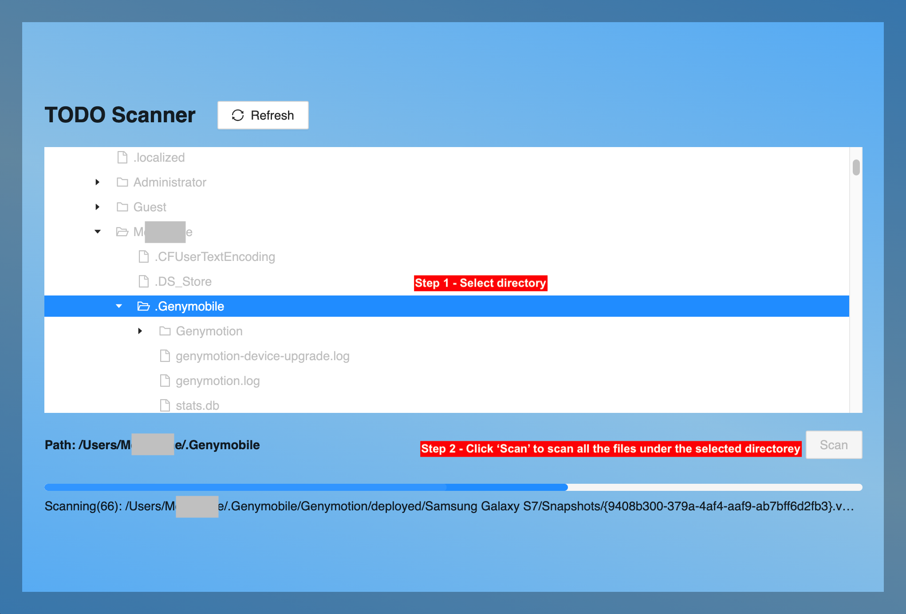

# TODO SCANNER

A simple 'todo' scanner to find a keyword 'todo' in all files.

## Tech Stack

- Electron React Boilerplate (https://electron-react-boilerplate.js.org/)
- Ant Design

## Install Packages

Install all dependencies:

```bash
yarn
```

## Starting Development

Start the app in the `dev` environment:

```bash
yarn start
```

## Packaging for Production

To package apps for the local platform:

```bash
yarn package
```

## Testing
To run the test:

```bash
yarn test
```

To run the test with coverage:

```bash
yarn test-coverage
```

## How to Use


## Docs

[Electron React Boilerplate](https://electron-react-boilerplate.js.org/docs/installation)
